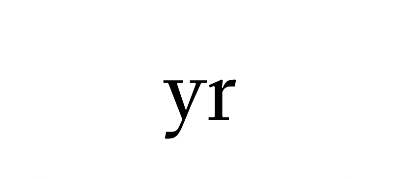

<h1 align="center">
    
</h1>
<p align="center">
    The only home server you need.<br><i>The first tool from yrKit!</i>
</p>
<p align="center">
    <sup>Latest version: v0.0.2</sup>
</p>

# Introduction
This is the introduction section of the README. Ask 3 questions here: What? Why? and How? .

## What?
`yrHost` is a home server that's packed with features and services to replace your daily online services, whether it be Google Drive, Google Photos, Spotify, etc. This project is actually more of a template for an API that you can use across all devices. The GUI in the website is only a simpler way to use the API. In the following sections of this README file, you'll learn how to install, configure, and use `yrHost`.  

In this tool, there are 4 services...
- **yrFiles**: a Google Drive alternative
- **yrSound**: a Spotify alternative
- **yrChat**: chat with your buddies that are connected to your WiFi
- **yrShare**: an AirDrop alternative

## Why?
Well, from my personal experience, I *love* privacy. I also like having no ads or subscription modals bugging me. So, I decided to make my own clone of the services that I always use. Now, you might be asking...
> *"What's the point if you're just gonna save it to your own computer??"*

...and you're right. If you wanted to, you could just store all of the files from Google Drive to your local drive, save your photos to your phone, listen to music with your built-in audio player, and etc. I know, jacka**. You're supposed to use it on another computer that can act as a full-time server. Google doesn't save all of a user's data from Drive to their employees' personal computers! You can also use this tool if you have an old laptop around and you don't know what to do with it. Use it to make a home server! More specifically, a `yrHost` home server!

## How?
With Go and HTML-CSS-JS. And it's Vanilla JS.

# Installation
At the time of writing this, the app is still in its beta, meaning that it isn't complete yet and that I'm still developing it. The following section for the installation of `yrHost` will be for people who either want to contribute, or people who want to see the progress for the tool, which is why you'll need to download and install the Go CLI, then clone (with `git`) & run the project with either...
```pwsh
git clone "https://github.com/PabloMyDarling/yrHost.git"; cd yrHost; go build; ./yrHost
```
or
```pwsh
git clone "https://github.com/PabloMyDarling/yrHost.git"; cd yrHost; go run .
```
These 2 commands work on all platforms.  
# Customizing
If you followed the Chad way (cloning and running the repo), you can edit the files inside the `yrHost` directory and type the following command every time you edit a file to your liking in the repo's directory.
```pwsh
go build; ./yrHost
```
or
```pwsh
go run .
```
But, if you followed the Unchad way (downloading the executable w/ `config.json`), you can still customize the tool using the `config.json` that you downloaded the executable with. Here, I'll teach you what each option means.  

```json
{
	"port": 3005, (the port number you want your server to run on)
	"sudo-auth": "password", (the password for administrator operations)
	"ip-blacklist": [], (IP addresses that can't use your server)
	"ip-whitelist": [], (the only IP addresses that can use your server)
	"services": ["files", "sound"], (the services to use, only "files" and "sound" are available)
	"users": [ (the users for your server, at least 1 is required)
		{
			"username": "root", "password": "root"
		}
	],
	"yrFiles": { (options for the "files" service)
		"save-path": "D:" (path to save your files to, RECOMMEND: use a drive, not a folder)
	},
	"yrPics": { (options for the "pics" service)
		"save-path": "E:" (path to save your photos to, RECOMMEND: use a drive, not a folder)
	}
}
```
This sample configuration was taken from [this](https://raw.githubusercontent.com/PabloMyDarling/yrHost/refs/heads/main/config.json) file. Don't copy this as an actual `config.json` for security.  

For more information about the topics discussed in this README, read the [Wiki](https://github.com/PabloMyDarling/yrHost/wiki). *(NOTE: I still have not made the Wiki at the time of writing this)*
